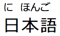

RubyAnn
--------
*(see also the original jQuery version
 [jquery.rubyann](https://github.com/PandaWood/jquery.rubyann))*

 I've written this non-jquery version to basically become the
 main library for rubyann... it has no dependencies; is more flexible
 and is written in TypeScript.

 [](https://nodei.co/npm/rubyann/)

**rubyann** is a small library for writing
[ruby annotations](https://en.wikipedia.org/wiki/Ruby_character)
using a simplified syntax. Basically, to avoid writing the
tedious XML required. This is most often used for Japanese
[furigana](https://en.wikipedia.org/wiki/Furigana).

For most users, this will simply mean - **a convenient way of adding
Furigana to their Kanji in a web page.**

#### Example

It works by using the custom syntax below:

```
{日,に}{本,ほん}{語,ご}
```

ie `{kanji,furigana} any text here`

rubyann will parse this and can replace the HTML with ruby annotations
that looks like this:



This is done by using rubyann in javascript like this:
```
  let ann = new RubyAnn()
  ann.elements('.furigana-text')
```

You can also pass in your own delimiters (instead of curly braces) -
incase there's a conflict

eg `new RubyAnn('[]')` - the function/constructor takes 2 characters
in a string for start/end.

Another use of the library is to just get the raw XML/XHTML, without
affecting the DOM, to use however you need.
```
  let ann = new RubyAnn()
  ann.getXml('{鳥,とり}')   // returns '<ruby><rb>鳥</rb><rp>(</rp><rt>とり</rt><rp>)</rp></ruby>'
```

## Source Code
RubyAnn is written in [TypeScript](https://www.typescriptlang.org/) and
has a [Mocha](https://mochajs.org/) test suite and a [Demo Page](demo/demo.html) that can be
run locally.

## Build
#### Requirements

If you want to clone and build RubyAnn yourself you'll need:

[NodeJS](http://www.nodejs.org)

#### Tasks
`npm install` or `yarn` - installs the (NPM) dependencies ([yarn](https://yarnpkg.com/) is highly recommended)

`npm run release` or `yarn release` - transpiles the TypeScript source
and minifies the javascript to 'dist' directory

`npm run test` or `yarn test` - transpiles and runs the test suite
